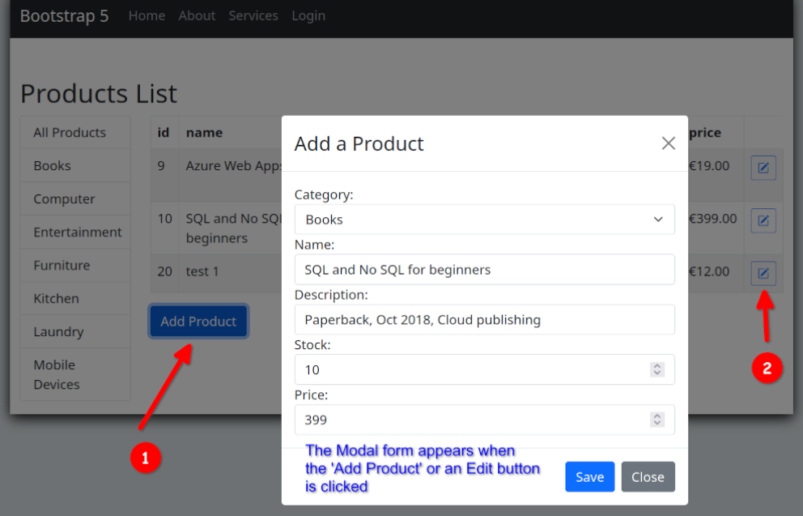
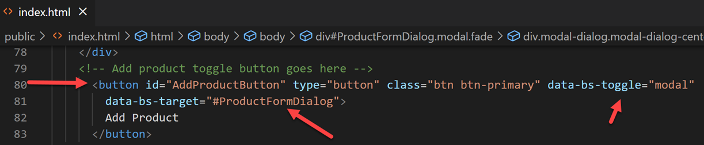
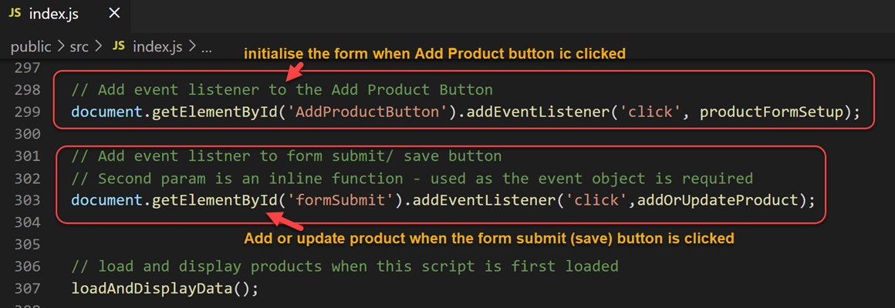
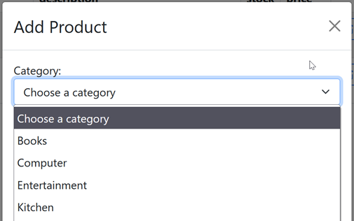
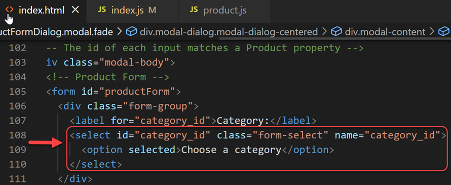
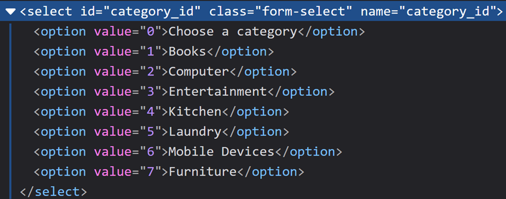
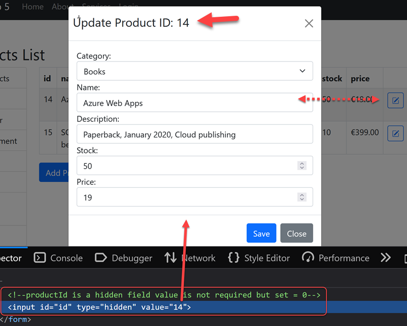
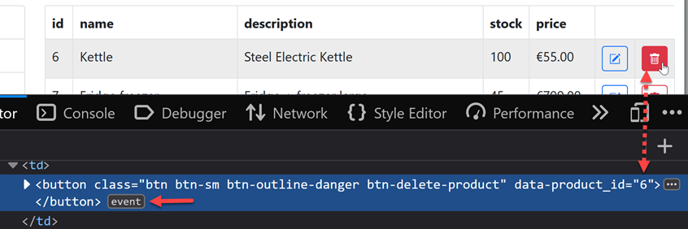
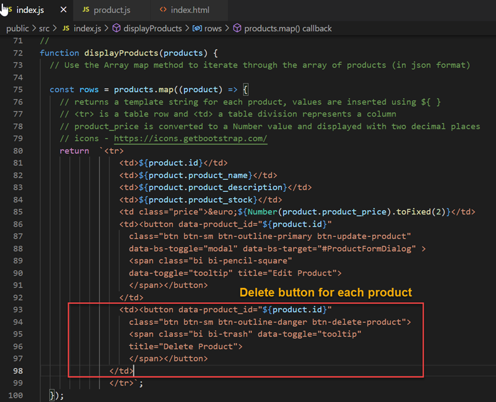
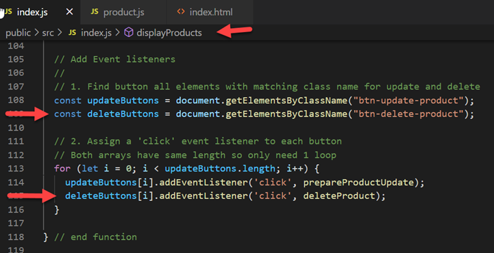

# 6.1 Web API & Client: Product Add, Update, and Delete

Enda Lee 2022

### Quick Start

1. Make sure the **[latest Server API](https://github.com/elee-tudublin/2022.SSWD_7.1_Web-API_CRUD)** app is running on http://localhost:5000
2. Download the start site from this repository.
3. Open in VS Code (separate to the server API instance).
4. In a terminal run `npm install`.
5. Start the application using `npm run start` so that it runs on http://localhost:3000


## Introduction

This tutorial adds client-side functionality to access the API `CRUD` functions via the web UI.

The finished site will include an **Add Product** button, when clicked this will reveal a modal form where details for the new product can be entered and submitted. The form is also displayed for editing existing products.




## Pre-requisites

As always, the application is based on **separate** **`client`** and **`server`** applications which should be opened in separate VS Code instances when working on this lab.

##### Server-side

The client functionality is dependent on a server API with Category and Product endpoints.

Start with the completed server API to date:

https://github.com/elee-tudublin/2022.SSWD_7.1_Web-API_CRUD

##### Client-side:

Start with the code from this repository which should be downloaded and opened in VS Code.


## Part 1: Add a new Product via the form

The App product form is hidden by default and only displayed when the **Add Product** or an **Edit** button is clicked. When displayed it acquires *focus* and the page is greyed out in the background.

### 1. Show the form when the Add Product button is clicked

The button has been added under the product table. It has been configured to toggle (show/ hide) the Bootstrap modal form added in the previous tutorial.



In addition to Bootstrap, we also need to initialise the form (e.g. for create or update). At the bottom of **`index.js`** click event listeners are attached to the `Add Product` button and also to the `Save` button inside the form (this will be used later). 



When the  `Add Product` button is clicked the `productFormSetup()` function is called. Its job is to initialise the form:

1. Set a title - Add Product (default) or Update Product.
2. Reset and clear previous values.

```{.javascript .numberLines .lineAnchors}
//
// Setup product form
function productFormSetup(event, formTitle = 'Add Product') {
  // reset the form and change the title
  document.getElementById('productForm').reset();
  document.getElementById('productFormTitle').innerText = formTitle;

  // form reset doesn't work for hidden inputs!!
  // do this to rreset previous id if set
  document.getElementById("id").value = 0;
} // End function
```


### 2. Show category names in the form

The form has been updated from the previous tutorial to show category names in a select box, instead of the less meaningful (to humans) id value.




Each `option` item in the select box  

Open **`index.html`** to see the `select` input with `id="category_id"`




When filled in the page, inspecting the select list reveals a `value` and `name` for each category. 




The code which fills the category `select` can be found in the **`displayCategories()`** function in **`index.js`**. *Read the code comments for details*

```{.javascript .numberLines .lineAnchors}
  //
  // *** Fill select list in product form ***
  // first get the select input by its id
  let catSelect = document.getElementById("category_id");

  // remove any existing options from the select
  // loop and keep deleting until no first item/ child remaining
  while (catSelect.firstChild)
    catSelect.removeChild(catSelect.firstChild);

  // Add a select option for each category
  // iterate through categories adding each to the end of the options list
  // each option is made from categoryName, categoryId
  // Start with default option
  catSelect.add(new Option("Choose a category", "0"));
  for (let i = 0; i < categories.length; i++) {
    catSelect.add(new Option(categories[i].category_name, categories[i].id));
  }
```


### 3. Saving a new product

The function **`addOrUpdateProduct()`** in  **`index.js`** is called when the form `save` button is clicked. Note the button has `id="formSubmit"`. 

This function performs the following:

1. Get the form data (as filled by a user prior to pressing the button).
2. Decide whether to `add` or `update`. This is based on the id value, existing products have an id new ones do not.
3. Set the `HTTP method` for the request - `POST` for a new product, otherwise `PUT` for update.
4. Call the appropriate API endpoint to add or update a product.
5. Refresh the page

*Read the code comments for details*

```{.javascript .numberLines .lineAnchors}
//
// Called when add product form is submitted
async function addOrUpdateProduct() {

  // url for api call
  const url = `${api.BASE_URL}/product`
  // New product = POST, Update = PUT
  let httpMethod = 'POST';

  // Get the form data
  const formProduct = getProductForm();
  // log to console
  console.log('%cNew Product: ', 'color: green', formProduct);

  // Check if new product or update
  // Only existing products have formProduct.id > 0
  if (formProduct.id > 0) {
    httpMethod = 'PUT';
  }

  console.log('product: ', httpMethod);
  // use fetchInit to build the request
  // Provide the HTTP method and body data
  const request = api.fetchInit(httpMethod, JSON.stringify(formProduct)); 

  try {
    // Call fetch and await the respose
    // fetch url using request object
    const result = await api.getDataAsync(url, request);

    // Output result to console (for testing purposes) 
    console.log(result);

    // catch and log any errors
  } catch (err) {
    console.log(err);
    return err;
  }

  // Refresh products list
  loadAndDisplayData();

} // End Function
```


#### The `getProductForm()` function

The `addOrUpdateProduct()` makes a call to **`getProductForm()`** to read the form values. 

```{.javascript .numberLines .lineAnchors}
  // new Product object constructed from the form values
  // Note: These should be validated!!
  return new Product(
    // read the form values and pass to the Product constructor
    // Uses element name attribute to access directly
    productForm.id.value,
    productForm.category_id.value,
    productForm.product_name.value,
    productForm.product_description.value,
    productForm.product_stock.value,
    productForm.product_price.value
  );
} // End function
```


The function returns a new `Product` based on **`product.js`** in the **`models` folder**. This mirrors the process used on the server-side to create a `product` object. 

```{.javascript .numberLines .lineAnchors}
function Product(id = 0, cat, name, desc, stock, price) {

    this.id = Number(id);
    this.category_id = Number(cat);
    this.product_name = name;
    this.product_description = desc;
    this.product_stock = Number(stock);
    this.product_price = Number(price);
}

// export this as a module
export { 
    Product
}
```


### 4. Test the form

Test the application to ensure that a new product can be added via the form. Check the browser and server-side consoles for any errors or other output.


## Part 2: Update an existing Product via the form

Most of the work required to update a product has already been implemented. In the previous tutorial we added an update button for each product in the HTML table. When clicked this button called the `prepareProductUpdate()` to fill out the form.

```{.javascript .numberLines .lineAnchors}
// Fill the product form when an edit button is clicked
//
async function prepareProductUpdate() {

  try {
    // 1. Get product by id
    // dataset.product_id is the id of the button element which called this function
    const product = await api.getDataAsync(`${api.BASE_URL}/product/${this.dataset.product_id}`);

    // 2. Set form defaults
    productFormSetup(0, `Update Product ID: ${product.id}`);

    //const productForm = document.getElementById('productForm');

    // Fill out the form
    // This works because the name attribute is set for the form and fields, in addition to id.
    productForm.id.value = product.id; // a hidden field - see the form
    productForm.category_id.value = product.category_id;
    productForm.product_name.value = product.product_name;
    productForm.product_description.value = product.product_description;
    productForm.product_stock.value = product.product_stock;
    productForm.product_price.value = product.product_price;

  } catch (err) {
    console.log(err);
  }
} // End Function
```


#### Update product `id`

After the form fills, the `id` of the existing product won't appear in an input field but should display in the title.  It is also set in a `hidden field` which can be revealed by inspecting the form element in your browser.




#### Saving changes

When updating an existing product, the **`addOrUpdateProduct()`** uses a `product id` value (> 0)  to determine that an update is required and  sets the `HHTP method` to `PUT` before calling the API.

Test product update to make sure it works.


## Part 3: Delete a product

Finally we will add the functionality to delete a product.

### 1. Delete buttons

Similar to product updates, we can add a delete button next to each product in the display table. When clicked, a function will read the `data-product_id` value and initiate delete of that product.




Modify `displayProducts()` adding the button in the table row output for each product, after the update button (which was added as part of the previous tutorial)




```{.javascript .numberLines .lineAnchors}
              <td><button data-product_id="${product.id}" 
                  class="btn btn-sm btn-outline-danger btn-delete-product">
                  <span class="bi bi-trash" data-toggle="tooltip" 
                  title="Delete Product">
                  </span></button>
              </td>
```


Then attach event handlers (again in the `displayProducts()` function) so that when a delete button click clicked, the `deleteProduct()` function is called:




### 2. `deleteProduct()` function

Add the **`deleteProduct()`** to **`index.js`**. It will be called when a button is clicked. It do the following:

1.  Define the API endpoint for delete.
2.  Build an HTTP request specifying the `DELETE` method.
3. Confirm the delete using JavaScript confirm in the browser.
4. Call the API.
5. Refresh the page.

```{.javascript .numberLines .lineAnchors}
// Delete product by id using an HTTP DELETE request
async function deleteProduct() {
  // url for delete product endpoint
  const url = `${api.BASE_URL}/product/${this.dataset.product_id}`;
  console.log('delete url ', url);

  // Build the HTTP request object (set delete method)
  const request = api.fetchInit('DELETE');

  // Confirm delete
  if (confirm("Are you sure?")) {
    try {
      // call the api and get a result
      const result = await api.getDataAsync(url, request);
      console.log('delete result: ', result)
      //if (Number(result) === 1)
        // if success (true result), refresh products list
        loadAndDisplayData();

      // catch and log any errors
    } catch (err) {
      console.log(err);
      return err;
    }
  }
} // End Function
```

### 3. Test

Test the delete functionality, making sure that it behaves as expected.


## Exercises

1. Add all the required functionality and ensure that it works.
2. Validate inputs in the product form before calling the API.


------

Enda Lee 2022